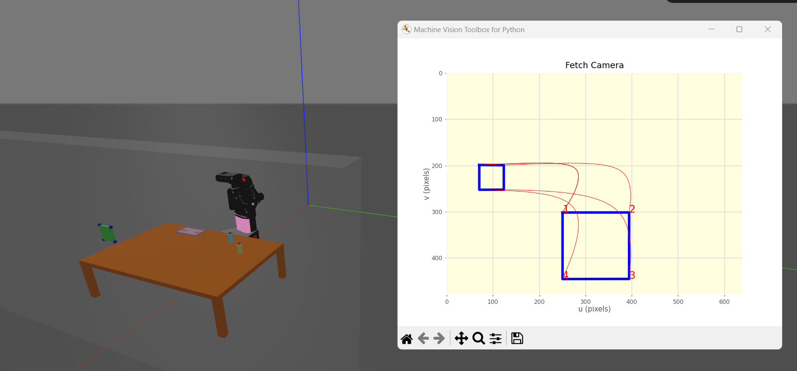

# 41014-Sensor-and-Control-Project

## Fetch Visualising and Grasping Objects on Table
Project for Sensor and Control for Mechatronics System subject, using the Fetch platform to grasp objects

## Description
The Fetch system will start from an arbitrary initial position and use its RGB-D camera to navigate 
around and identify the table. Then, the platform's integrated mobile base will take control to 
reach a location where it can comfortably manipulate the target objects on the table. Since then, 
it will involve further visualisation and grasping actions as a collaboration between the camera and the robotic arm.

Steps breakdown:
- Identify a near-table tasking position from an arbitrary initial position using the camera 
- Control the mobile base to reach the tasking position
- Identify the objects on the table using the camera
- Control the arm to pick and place the objects in sequence

## Requirements
Required Python 3.7 above, the Robotics Toolbox for Python (RTB-P), and some dependencies:
    
    $ pip install rvc3python
    
    $ pip install machinevision-toolbox-python
    
    $ pip install ir-support

## How to run:
Execute **main_file.py**

Video for what will happen: 
